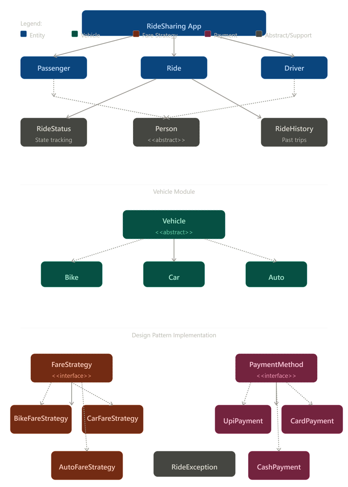
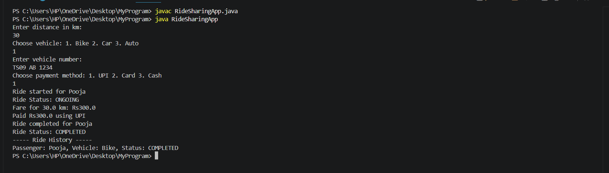
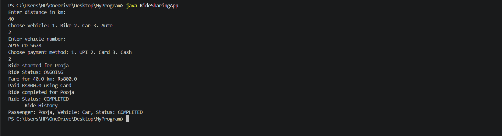
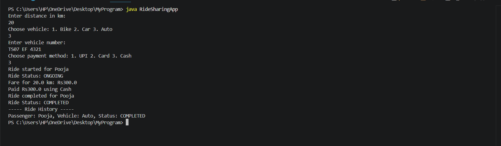

# 🚖 RideMaster

A modular Java-based ride booking simulation system designed to demonstrate Object-Oriented Programming (OOP), Design Patterns, and software engineering principles.

RideMaster simulates the core workflow of a ride-hailing application, including vehicle selection, fare computation, payment processing, ride lifecycle management, and ride history tracking. The project emphasizes clean architecture, extensibility, and maintainable code design.

---

## 📖 Overview

RideMaster allows a passenger to book a ride by selecting a vehicle type and payment method. The system dynamically calculates fares using the Strategy Design Pattern and manages ride status throughout the ride lifecycle.

The project was developed to gain hands-on experience with:

- Object-Oriented Programming
- Strategy Design Pattern
- Interfaces and Abstract Classes
- Exception Handling
- Modular Software Design
- Java Collections Framework

---

## ✨ Features

### 🚗 Vehicle Management
- Multiple vehicle types
  - Bike
  - Car
  - Auto
- Vehicle-specific fare calculation

### 💳 Payment Processing
- UPI Payment
- Card Payment
- Cash Payment

### 🎯 Ride Management
- Start Ride
- End Ride
- Ride Status Tracking
- Driver Availability Tracking

### 📚 Ride History
- Stores completed rides
- Displays ride history

### ⚠️ Exception Handling
- Driver availability validation
- Invalid distance validation

---

## 🏗️ System Architecture



The architecture demonstrates:

- Abstraction using abstract classes
- Inheritance through specialized entities
- Strategy Pattern for fare calculation
- Strategy Pattern for payment processing
- Composition between Ride and supporting modules

---

## 🔄 Application Workflow

```text
Passenger
    │
    ▼
Select Vehicle
    │
    ▼
Choose Payment Method
    │
    ▼
Calculate Fare
    │
    ▼
Start Ride
    │
    ▼
Process Payment
    │
    ▼
Complete Ride
    │
    ▼
Store Ride History
```

---

## 🎨 Design Patterns Used

### Strategy Pattern

RideMaster uses the Strategy Design Pattern to dynamically select:

#### Fare Calculation Strategy

```text
FareStrategy
│
├── BikeFareStrategy
├── CarFareStrategy
└── AutoFareStrategy
```

Each vehicle type uses a different fare calculation algorithm.

#### Payment Strategy

```text
PaymentMethod
│
├── UpiPayment
├── CardPayment
└── CashPayment
```

This enables payment methods to be swapped without modifying ride logic.

---

## 🧩 OOP Concepts Demonstrated

### Abstraction

Abstract classes:

```java
Person
Vehicle
```

Interfaces:

```java
FareStrategy
PaymentMethod
```

### Inheritance

```text
Person
├── Passenger
└── Driver

Vehicle
├── Bike
├── Car
└── Auto
```

### Polymorphism

Different implementations of:

- FareStrategy
- PaymentMethod

are selected at runtime.

### Encapsulation

Sensitive data such as:

- name
- phone number
- vehicle details

are accessed through getters and setters.

---

## 📂 Project Structure

```text
RideMaster
│
├── RideSharingApp.java
│
├── Person.java
├── Passenger.java
├── Driver.java
│
├── Vehicle.java
├── Bike.java
├── Car.java
├── Auto.java
│
├── FareStrategy.java
├── BikeFareStrategy.java
├── CarFareStrategy.java
├── AutoFareStrategy.java
│
├── PaymentMethod.java
├── UpiPayment.java
├── CardPayment.java
├── CashPayment.java
│
├── Ride.java
├── RideStatus.java
├── RideHistory.java
├── RideException.java
│
├── architecture.png
│
├── screenshots
│   ├── BikeScreenshot.png
│   ├── CarScreenshot.png
│   └── AutoScreenshot.png
│
└── README.md
```

---

## 📸 Sample Outputs

### Bike Ride + UPI Payment



---

### Car Ride + Card Payment



---

### Auto Ride + Cash Payment



---

## ▶️ Getting Started

### Clone Repository

```bash
git clone https://github.com/Pooja-Naik7799/RideMaster.git
```

### Navigate to Project

```bash
cd RideMaster
```

### Compile

```bash
javac RideSharingApp.java
```

### Run

```bash
java RideSharingApp
```

---

## 🧪 Sample Execution

```text
Enter distance in km:
30

Choose vehicle:
1. Bike
2. Car
3. Auto

Enter vehicle number:
TS09 AB 1234

Choose payment method:
1. UPI
2. Card
3. Cash

Ride started for Pooja

Ride Status: ONGOING

Fare for 30.0 km: Rs300.0

Paid Rs300.0 using UPI

Ride completed for Pooja

Ride Status: COMPLETED
```

---

## 🚀 Future Enhancements

- GUI using JavaFX or Swing
- Database integration using MySQL
- Driver allocation system
- User authentication
- Ride cancellation support
- Dynamic surge pricing
- GPS and route simulation
- REST API integration
- Admin dashboard

---

## 📈 Learning Outcomes

Through this project I gained practical experience in:

- Java Programming
- Object-Oriented Design
- Strategy Design Pattern
- Exception Handling
- Collections Framework
- Software Architecture
- Modular Code Organization
- Git & GitHub

---

## 👩‍💻 Author

### Badavathu Pooja Naik

B.Tech Computer Science and Engineering

Shri Vishnu Engineering College for Women

GitHub: https://github.com/Pooja-Naik7799

---

⭐ If you found this project interesting, consider giving it a star.
